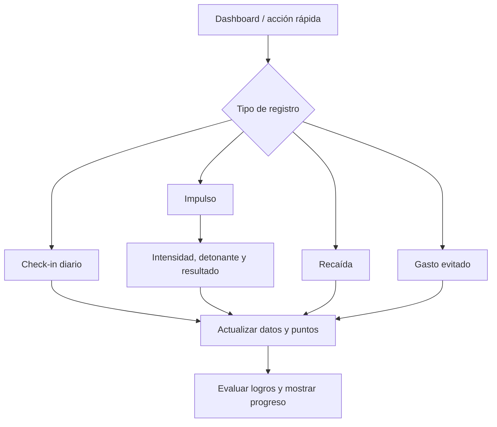

# UX Flows actuales

## Referencias por rol

- Historias, criterios de aceptación y estado real: [`ROLE_USER_STORIES.md`](./ROLE_USER_STORIES.md).
- Guías rápidas y mockups textuales: [`QUICK_GUIDES_BY_ROLE.md`](./QUICK_GUIDES_BY_ROLE.md).
- Skill reutilizable para otros agentes: [`../.agents/skills/sophena-role-documentation/SKILL.md`](../.agents/skills/sophena-role-documentation/SKILL.md).

La documentación distingue entre capacidades implementadas y roles que solo están catalogados en la base de datos. La seguridad efectiva se mantiene en Supabase/RLS/RPC.

Los flujos siguientes reflejan rutas y servicios encontrados en el código; no representan funcionalidades futuras.

## Entrada y autenticación

```mermaid
flowchart TD
  A[/welcome] --> B[/register]
  A --> C[/login]
  C --> D[/forgot-password]
  D --> E[/reset-password]
  B --> F[Onboarding]
  F --> G[Guardar onboarding pendiente]
  G --> H[/app]
  C --> H
```

## Registro de actividad



## Navegación personal

`/app` contiene módulos con navegación desktop y móvil. Los módulos adicionales se cargan desde `adminService.listModules()` y solo se muestran si están habilitados, tienen ruta `/app/*` y corresponden al usuario/rol.

## Administración

`/super-admin/*` entra por autenticación administrativa y expone vistas para usuarios, roles/permisos, módulos, settings, temas, logros, feed y documentación. Los datos se gestionan mediante `dataApi.adminService`.

Las novedades se leen en `/feed/:postId`; el detalle genera metadatos sociales y ofrece compartir nativo o enlaces directos. El editor permite subir portadas al bucket `feed-covers` de Supabase y reutiliza su URL pública en el feed y en los metadatos sociales. El renderizado server-side para crawlers está descrito en [`SEO_SOCIAL_SHARING.md`](./SEO_SOCIAL_SHARING.md).

## Recomendaciones, no implementación

Evaluar en iteraciones posteriores si el onboarding puede reducir carga cognitiva y si el flujo común de check-in puede conservarse en uno o dos taps. No modificar estos flujos en esta tarea.
